# edge-influxdb2

The 2.0 version of the famous InfluxData Database framework.

- [edge-influxdb2](#edge-influxdb2)
  - [Introduction](#introduction)
    - [Before Starting](#before-starting)
  - [Requirements](#requirements)
    - [Used Components](#used-components)
    - [Hardware Requirements](#hardware-requirements)
    - [Software Requirements](#software-requirements)
  - [Installation](#installation)
    - [Download the App](#download-the-app)
    - [Create new Standalone Application](#create-new-standalone-application)
    - [Upload application to Industrial Edge Management](#upload-application-to-industrial-edge-management)
      - [Connect your Industrial Edge App Publisher](#connect-your-industrial-edge-app-publisher)
    - [Import a Standalone Application in Industrial Edge Management](#import-a-standalone-application-in-industrial-edge-management)
  - [Usage](#usage)
    - [Connect to InfluxDB Web UI](#connect-to-influxdb-web-ui)
    - [Reading data from the database with InfluxDB Web Ui](#reading-data-from-the-database-with-influxdb-web-ui)
    - [Generate Tokens for external Clients or Data Sources](#generate-tokens-for-external-clients-or-data-sources)
  - [Application Examples](#application-examples)
    - [Description](#description)
    - [Scope of the examples](#scope-of-the-examples)
    - [Before starting with examples](#before-starting-with-examples)
    - [Install InfluxDB node on NodeRED](#install-influxdb-node-on-nodered)
    - [Configuring data exchange with SIMATIC S7 Connector App and IE Databus App](#configuring-data-exchange-with-simatic-s7-connector-app-and-ie-databus-app)
    - [ConnectionMap creation for Tag Name - Tag Id Mapping](#connectionmap-creation-for-tag-name---tag-id-mapping)
    - [Writing data from IE Databus with MQTT protocol to InfluxDB database](#writing-data-from-ie-databus-with-mqtt-protocol-to-influxdb-database)
      - [Bulk message receiving from MQTT](#bulk-message-receiving-from-mqtt)
      - [Pre-processing Data for InfluxDB](#pre-processing-data-for-influxdb)
      - [Sending Data to InfluxDB](#sending-data-to-influxdb)
    - [Dashboard for Displaying Results with InfluxDB UI](#dashboard-for-displaying-results-with-influxdb-ui)
    - [Read data from InfluxDB database with temporal and conditional filtering](#read-data-from-influxdb-database-with-temporal-and-conditional-filtering)
    - [Generate Alerts from InfluxDB to IE Databus](#generate-alerts-from-influxdb-to-ie-databus)
      - [Enable InfluxDB topic on IE Databus](#enable-influxdb-topic-on-ie-databus)
      - [Configure the Alert Task on InfluxDB](#configure-the-alert-task-on-influxdb)
      - [Subscribe to InfluxDB Alerts using Flow Creator](#subscribe-to-influxdb-alerts-using-flow-creator)
      - [Visualize Alerts on Flow Creator Dashboard](#visualize-alerts-on-flow-creator-dashboard)
  - [Documentation](#documentation)
  - [Contribution](#contribution)
  - [License & Legal Information](#license--legal-information)

## Introduction

The edge-influxdb2 application allows you to bring directly to the Edge Device database and administration services of the latest [InfluxDB 2.0](https://docs.influxdata.com/influxdb/v2.0/) framework, expressly dedicated to data as time series.

[InfluxDB](https://www.influxdata.com/products/influxdb/) is a time series database built to handle high write and query loads. InfluxDB is a high-performance custom datastore written specifically for time-series data, and particularly useful for use cases such as IoT monitoring and real-time analytics. InfluxDB also offers a SQL-like query language to interact with the data

For more information on InfluxDB 2.0 check out the [Documentation](#documentation).

Some information about InfluxDB can be found also in the [edge-influxdata-stack app documentation](https://github.com/SiemensIndustrialEdgeITA/edge-influxdata-stack) that use the previous InfluxDB 1.8 version.

### Before Starting

This guide describes how to use and install the **edge-influxdb2** App.

Check the necessary requirements on [Requirements](#requirements) before proceeding with the installation. Details for the installation procedure can be found on [Installation](#installation).

For details about how to use the InfluxDB service see [Usage](#usage) section and for all online references about usage see [Documentation](#documentation) section.

The application comes with an [Application Example](#application-example), which shows how to manage the data flow with the InfluxDB database via the **SIMATIC Flow Creator** application and the dedicated node [node-red-contrib-influxdb](https://flows.nodered.org/node/node-red-contrib-influxdb).

For more information on installing the dedicated InfluxDB node see [Install InfluxDB Node on NodeRED](#install-influxdb-node-on-nodered).

The section [Build](#build) shows in detail how this application was built using the Docker environment.

## Requirements

### Used Components

- OS: Windows or Linux
- Docker minimum V18.09
- Docker Compose V2.0 – V2.4
- Industrial Edge App Publisher (IEAP) V1.2.8
- Industrial Edge Management (IEM) V1.2.16
- Industrial Edge Device (IED) V1.2.0-56

### Hardware Requirements

- The edge-influxdb application is only compatible with SIEMENS devices that have Industrial Edge functionality enabled.

### Software Requirements

- The edge-influxdb application needs **1300 MB** of RAM to run since all the required services are included in only one service (unlike the previous version 1.8):

| Service name | Memory limit |
|--------------|--------------|
| edge-influxdb | 1300 MB |

> **Note:** This limit has been set for an average data volume in the InfluxDB database and to ensure a constant average usage of dashboards, tasks and other functions, but they can be modified according to your needs by acting on the docker-compose file and then on the app configuration in the Edge App Publisher software, creating a custom version of this application.

## Installation

You find below the steps required for downloading the pre-compiled app or to creating and install an edge application starting from the source code here provided.
Please refer to [Documentation](#documentation) for detailed information about Industrial Edge App Development.

### Download the App

The **edge-influxdb2** app can be downloaded in .app format using this secure Google Drive link:

- [edge-influxdb2_0.0.7.app](https://drive.google.com/file/d/11aNMtNEmzvsaA5PFWCsD-K1tKEE5Yb1_/view?usp=sharing)

### Create new Standalone Application

- Open the **Industrial Edge App Publisher**
- Go to `Standalone Applications` section
- Import the [docker-compose](docker-compose.yaml) file using the `Import YAML` button
- Click on `Review` and `Validate & Create`.

### Upload application to Industrial Edge Management

You find below a short description on how to publish your application in your IEM.

For more detailed information please see the official Industrial Edge GitHub guide for [uploading apps to the IEM](https://github.com/industrial-edge/upload-app-to-industrial-edge-management).

#### Connect your Industrial Edge App Publisher

- Connect your Industrial Edge App Publisher to your **Docker engine**
- Connect your Industrial Edge App Publisher to your **Industrial Edge Managment**

### Import a Standalone Application in Industrial Edge Management

- Create a new Project in the connected IEM or select a existing one
- Import the standalone application created [above](#create-new-standalone-application) to the selected IEM Project
- Press `Start Upload` to transfer the app to Industrial Edge Management

Further information about using the Industrial Edge App Publisher can be found in the [IE Hub](https://iehub.eu1.edge.siemens.cloud/documents/appPublisher/en/start.html).

## Usage

InfluxDB is a time series database designed to handle high write and query loads. InfluxDB is meant to be used as" "backing store" for any use case involving large amounts of timestamped data, including DevOps monitoring, application metrics, IoT sensor data, and real-time analytics.

InfluxDB 2.0 provides a Query languages called [Flux](https://docs.influxdata.com/influxdb/v2.0/reference/flux/) that can be used to query, transform and process data from saved measurements.

Below you will find how to get started with edge-influxdb2 app and some uses case provided in the [application examples](#application-examples) section.

### Connect to InfluxDB Web UI

Using the InfluxDB Web UI is it possible to administer the InfluxDB Database, visualize and monitoring collected data using custom queries and easily create alerting rules and data flow automation.

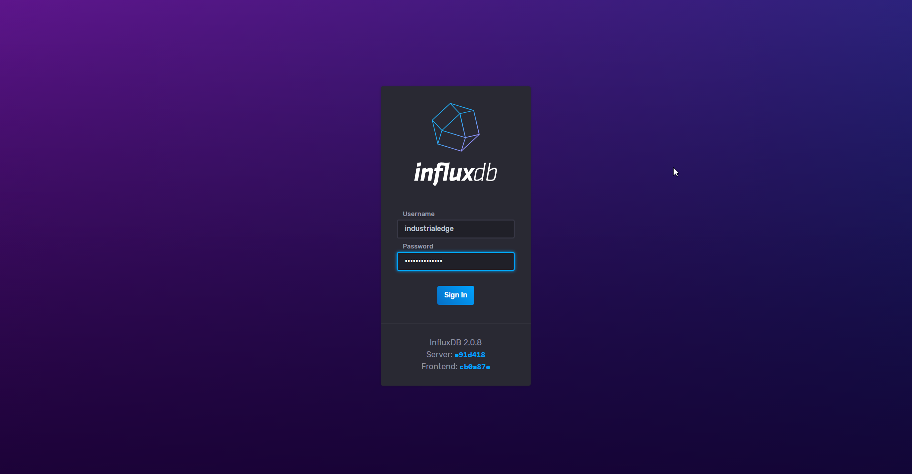

- Connect to WebUI from external network:
  - `http://[device-ip-address]:38086`

The default user that can access to WebUI is **industrialedge** with password **industrialedge** as configured in [docker-compose](docker-compose.yml) file by the Environment variables `DOCKER_INFLUXDB_INIT_USERNAME` and `DOCKER_INFLUXDB_INIT_PASSWORD`.

### Reading data from the database with InfluxDB Web Ui

In order to quickly consult the collected data or to test queries, it is useful to use InfluxDB Web UI and its **"Explore"** feature. Here you will be able to use InfluxDB query languages including InfluxQL to query the database and view the data in different graphical modes in a guided manner.

The following are the steps to be able to perform a query with the guided menu within the "Explore" section:

1. Connect to the InfluxDB Web UI using the URL `http://[device-ip-address]:38086`
2. In the **"Explore"** section, select in the **"FROM"** column the name of the **Bucket**  to be queried.
3. Then select in the **"Measurement"** column the measurement of interest
4. Then select the Fields in the **"Fields"** column that you want to read and eventually apply the predefined aggregation functions.
5. A query will appear in the editor pane, which you can edit by clicking on **Script Editor** if necessary in order to modify the result in Flux Language
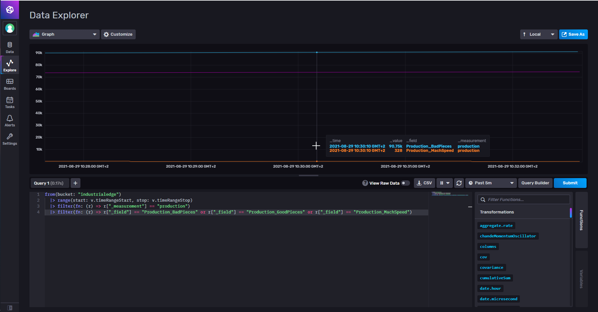

6. Using the **time selector** at the top right it is possible to set the time range of data request
7. Using the **"Visualization"** selector at the top left it is possible to modify the type of data visualization

### Generate Tokens for external Clients or Data Sources

With InfluxDB 2.0 is more easy and secure to connect from external sources, you don't need to specify a user and a password but a Token string that can be generated from any user with inherited authorizations.

To generate a new Token or copy an existing Token string:

1. Connect to the InfluxDB Web UI using the URL `http://[device-ip-address]:38086`
2. In the **"Data"** section, open the **Tokens** submenu
3. Generate a New Token by clicking **Generate New Token**
4. Visualize existing tokens by clicking on items in the Tokens list

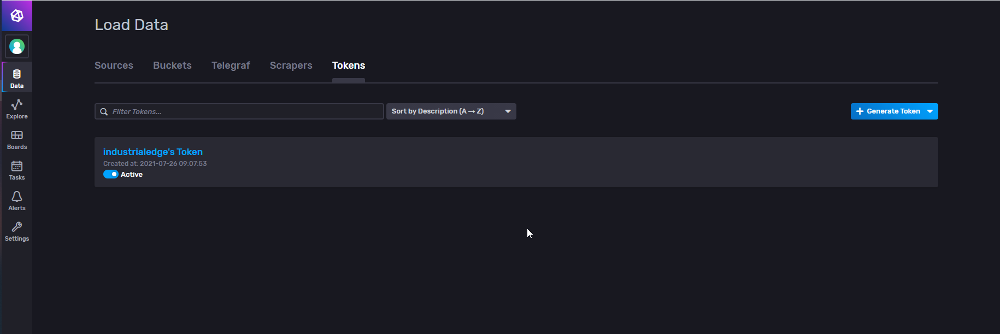

## Application Examples

### Description

Using databases allows you to save data to long term and to be able to act on the collected data for activities such as visualizing historical data or analyzing historical data to gain important information.

In this application example, it will be possible to use the InfluxDB database to implement effective data collection and multiple ways to visualize this information.

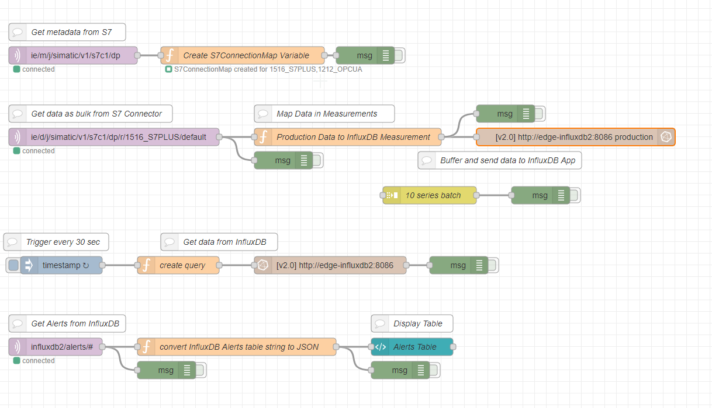

This application example use the same S7 PLC and the same PLC Tags of the Application Example of [edge-influxdata-stack](https://github.com/SiemensIndustrialEdgeITA/edge-influxdata-stack) application. For more information see the section **Application Example** of that repository.

### Scope of the examples

Using the functionality offered by the supplied application and the applications listed in the following section "Prerequisites", you will be able to implement various functionalities:

- Configuration of data exchange with SIMATIC S7 Connector App and IE Databus App
- Writing data coming from IE Databus with MQTT protocol in dedicated InfluxDB database
- Dashboard for results visualization with InfluxDB UI
- Read data from dedicated InfluxDB database with temporal filtering and conditional filtering
- Generate Alerts from InfluxDB to IE Databus

### Before starting with examples

- To enable communication with an S7 data source, a **PLC** from the SIMATIC family (S7-300, S7-1200. S7-1500,...).
- The **SIMATIC S7 Connector** application must be installed and configured on the Edge Device used.
- The **SIMATIC IE Databus** application must be installed and configured on the Edge Device used.
- The **SIMATIC Flow Creator** application must be installed on the Edge Device in use.
- The node **node-red-contrib-influxdb** must be installed in the node library of SIMATIC Flow Creator. For more details follow the section [below](#install-influxdb-node-on-nodered).

- The [flows_influxdb2_appexample.json](examples/flows_influxdb2_appexample.json) file has to be imported within the SIMATIC Flow Creator application via the **"Import"** functionality from the dedicated menu.
- The [Production_Dashboard.json](examples/Production_Dashboard.json) file contains the dashboard for Chronograf, which can be imported from the application.
- The **edge-influxdb2** application must be installed on the Edge Device used. For more details follow section [Installation](#installation).
- The edge-influxdb2 application comes with a pre-loaded bucket named `"industrialedge"`. This database must necessarily exist in order for the created NodeRED stream to work properly.

### Install InfluxDB node on NodeRED

> **NOTE** - The installation of additional nodes in the SIMATIC Flow Creator application (based on Node-RED) is permitted, but these nodes are not officially supported by Siemens.

1. Open the **Editor** page of the **SIMATIC Flow Creator** application by clicking on the icon on the Edge Device UI or by using the URL `https://[core name]/sfc-root/`.
2. From the main menu navigate to the submenu **"Manage Palette"**.
3. Go to the **"Install"** section
4. Search for the node with the name `node-red-contrib-influxdb` and press the **"Install"** button to start the installation.
5. When the installation is finished, close the submenu by clicking the **"Close"** button.
6. If required by the installed node, a **restart** of the SIMATIC Flow Creator application may be necessary.

For more information, please refer to the official documentation of the node [node-red-contrib-influxdb](https://flows.nodered.org/node/node-red-contrib-influxdb).

### Configuring data exchange with SIMATIC S7 Connector App and IE Databus App

In order to be able to use the InfluxDB database for saving information, it is first necessary to perform a data exchange with a data source that can cyclically generate new values.

This application example considers the use of a SIMATIC S7 PLC data source, configured within the **SIMATIC S7 Connector** application by entering the properties necessary for communication and the list of variables to be monitored.
Within the S7 Connector application, in this case, an **S7-1500 CPU** is configured as Datasource with **S7+ protocol** and with **"Bulk Publish"** mode of data publication:

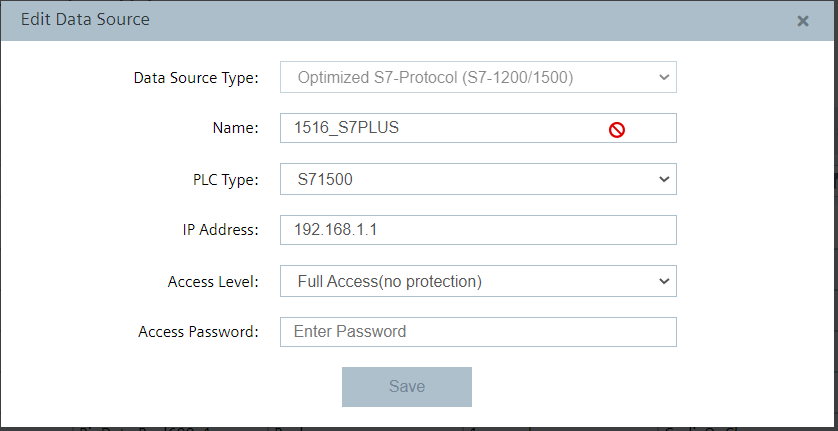

The Bulk Publish mode can be set through the **"Settings"** button present in the S7 Connector configuration interface of the S7 Connector, together with the **user** and **password** used to connect to the MQTT broker of the SIMATIC IE Databus application (in this example we will use user _"edge"_ and password _"edge"_).

For this purpose 3 variables will be considered, schematized in the following table:

| Id Datapoint | Description | S7+ Address | Type | Access Mode |
|--------------|-------------|-------------|------|------------|
| _Production_GoodPieces_ | Counter Pieces Products | Production.GoodPieces | Dint | Read |
| _Production_BadPieces_ | Discarded Pieces Counter | Production.BadPieces | Dint | Read |
| _Production_MachSpeed_ | Production speed in pieces/min. | Production.MachSpeed | Real | Read&Write |

Below you can see the result of the configuration of the data source with S7 Connector in the **"Data Connections"** section of the Industrial Edge Management system:

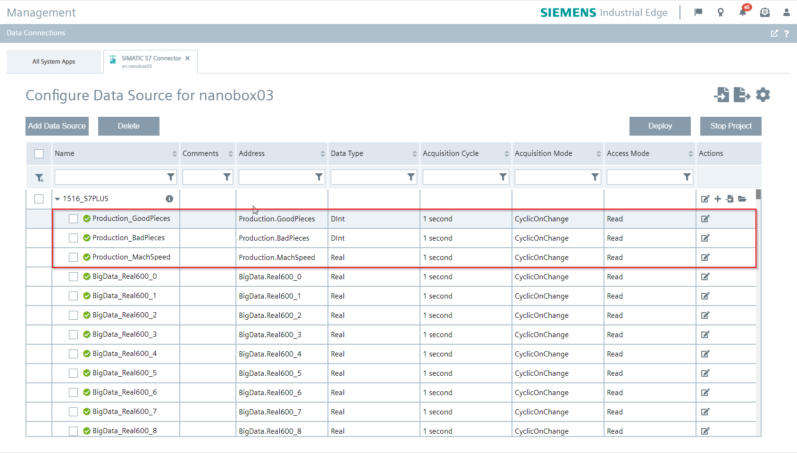

In the "Bulk Publish" mode, when the S7 Connector performs a data read, only one MQTT topic is used where all variables that changed their value in the configured cycle time are published (**"CyclicOnChange"** mode).
The data read from the configured variables will then be available through the **SIMATIC IE Databus** application using the MQTT topic dedicated to the configured datasource (in this example _"1516_S7PLUS"_), which will cyclically emit a JSON message containing also the `vals` property, an array containing all the properties of the read variables.

Here is an example of a JSON message obtained by S7 Connector through MQTT when reading variables:

```bash
{
  "topic": "ie/d/j/simatic/v1/s7c1/dp/r/1516_S7PLUS/default",
  "payload": {
    "seq": 84631,
    "vals": [
      {
        "id": "101",
        "qc": 3,
        "ts": "2021-03-10T22:23:04.146Z",
        "val": 80
      },
      {
        "id": "102",
        "qc": 3,
        "ts": "2021-03-10T22:23:04.146Z",
        "val": 20
      },
      {
        "id": "103",
        "qc": 3,
        "ts": "2021-03-10T22:23:04.146Z",
        "val": 120.5
      }
    ]
  }
}
```

The typical properties of the message obtained by S7 Connector via MQTT when reading variables are analyzed below, with reference to the above example message:

| Property | Description | Example Value |
|----------|-------------|---------------|
| **topic** | Indicates the mqtt topic of the received message | ie/d/j/simatic/v1/s7c1/dp/r/1516_S7PLUS/default |
| **payload** | This is the body of the message. It contains all properties populated by S7 Connector | `{"seq": 84631, "vals": [...] }` |
| **seq** | Progressive number of the read sequence. Each new read increments this number by 1. | 84631 |
| **vals** | Array containing all variables read in a loop and their properties | `[{"id": "101", "qc": 3, "ts": "2021-03-10T22:23:04.146Z", "val": 120.5}, .... ]` |
| **id** | ID of the variable configured within the S7 Connector app | 103 |
| **qc** | Quality Code of reading | 3 |
| **ts** | Timestamp in ISO86901 (yyyy-MM-ddThh:MM:ss) format |"2021-03-10T22:23:04.146Z" |
| **val** | Value of the variable read | 120.5 |

For further information please refer to the dedicated manuals:

- [SIMATIC S7 Connector Operating Manual](https://support.industry.siemens.com/cs/us/en/view/109783783)
- [SIMATIC IE Databus Operating Manual](https://support.industry.siemens.com/cs/us/en/view/109783784)
- [Edge Management Operation Manual](https://support.industry.siemens.com/cs/us/en/view/109793845)

### ConnectionMap creation for Tag Name - Tag Id Mapping

As seen above, the messages received on the topic data contain an `"id"` property, a unique number assigned by **S7 Connector Configurator** to each configured Tag. The correspondence between `"id"` and `"name"` of the various tags is visible in the MQTT message called **"metadata"**, that S7 Connector Configurator sends to each MQTT client connected to the topic `ie/m/j/simatic/v1/s7c1/dp` and that is updated every time the configuration of the Data Source in S7 Connector is modified.

Below is an example of a received MQTT **"metadata"** message:

```json
{
  "topic": "ie/m/j/simatic/v1/s7c1/dp",
  "payload": {
    "seq": 1,
    "connections": [
      {
        "name": "1516_S7PLUS",
        "type": "S7+",
        "dataPoints": [
          {
            "name": "default",
            "topic": "ie/d/j/simatic/v1/s7c1/dp/r/1516_S7PLUS/default",
            "publishType": "bulk",
            "dataPointDefinitions": [
              {
                "name": "Production_GoodPieces",
                "id": "101",
                "dataType": "DInt"
              },
              {
                "name": "Production_BadPieces",
                "id": "102",
                "dataType": "DInt"
              },
              {
                "name": "Production_MachSpeed",
                "id": "103",
                "dataType": "Real"
              },
              {
                "name": "Production_RejectRatio",
                "id": "104",
                "dataType": "Real"
              }
            ]
          }
        ]
      }
    ]
  },
  "qos": 1,
  "retain": true
}
```

In order to trace the `"name"` of the Tag received from the `"id"` property it will be necessary to create a **link** between these two properties obtained on the Metadata topic from S7 Connector.
Inside the flow [flows_influxdb2_appexample.json](examples/flows_influxdb2_appexample.json)  provided in this application example there is a function that creates a global variable called `"S7ConnectionMap"` that contains several correspondence Javascript [Maps](https://developer.mozilla.org/en-US/docs/Web/JavaScript/Reference/Global_Objects/Map?retiredLocale=it) elements that allow to obtain the name of a Tag starting from the id and vice versa.

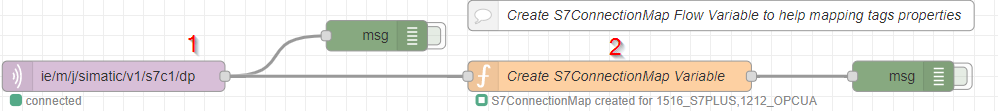

Below is an example of how to use the **"S7ConnectionMap"** variable in a Flow Creator "function" node:

```js
// get S7Map variable
let S7ConnectionMap = flow.get("S7ConnectionMap");

// find index of PLC connection
let connectionIndex = S7ConnectionMap.nameList.indexOf("1516_S7PLUS");

// use the PLC index to get the right PLC Name -> ID Map
let nameIDMap = S7ConnectionMap.nameIDMaps[connectionIndex];

// use the PLC index to get the right PLC ID -> Name Map
let IDnameMap = S7ConnectionMap.IDnameMaps[connectionIndex];


// USE MAPS
// get Tag ID from Tag Name
let tagId = nameIDMap.get("Production_MachSpeed")
//
// output >> 103

// get Tag Name from Tag ID
let tagName = IDnameMap.get(103)
//
// output >> "Production_MachSpeed"
```

This global variable is created from the MQTT message received by the **"MQTT In" (1)** node on the `ie/m/j/simatic/v1/s7c1/dp` topic with the following **"Function" (2)** node function:

```js
// Create an object that contains each S7 Connector connection property
// with different Map Objects to create correspondence between Tags IDs, Names and Types.

// initialize the connections Mapping Object
let S7ConnectionMap = {
    "nameList":[],      // array of available S7 Connections names. Order is the same in Map objects below.
    "typeList":[],      // array of available S7 Connections types. Order is the same of nameList..
    "nameIDMaps":[],    // array of Tags Names-IDs object. Order is the same of nameList.
    "IDnameMaps":[],    // array of Tags IDs-Names Map object. Order is the same of nameList.
    "IDTypeMaps":[]     // array of Tags IDs-Type Map object. Order is the same of nameList.    
}

// Check Payload
let m = msg.payload;
if (m.seq == undefined) {
    // update global maps
    flow.set("S7ConnectionMap", null);
    // update function node status
    node.status({fill:"red",shape:"ring",text:"S7Map cannot be created"});
    
    return null;
}  

// Iterate through connections
for (let i = 0; i < m.connections.length; i++)
{
    let connection = m.connections[i];
    // push connection name and type in global object
    S7ConnectionMap.nameList.push(connection.name);
    S7ConnectionMap.typeList.push(connection.type);
    // init maps
    let nameIDMap = new Map();
    let IDNameMap = new Map();
    let IDTypeMap = new Map();
    
    // Iterate through dataPoints
    let dataPoints = connection.dataPoints;
    for (let j = 0; j < dataPoints.length; j++)
    {
        let dataPoint = dataPoints[j];
        // Iterate through dataPointDefinitions
        let dataPointDefinitions = dataPoint.dataPointDefinitions;
        for (let k = 0; k < dataPointDefinitions.length; k++)
        {
            let dataPointDefinition = dataPointDefinitions[k];
            // push in maps the datapoint property
            nameIDMap.set(dataPointDefinition.name, dataPointDefinition.id);
            IDNameMap.set(dataPointDefinition.id, dataPointDefinition.name);
            IDTypeMap.set(dataPointDefinition.id, dataPointDefinition.dataType);        
        }
    }
    // push mappings in global object
    S7ConnectionMap.nameIDMaps.push(nameIDMap);
    S7ConnectionMap.IDnameMaps.push(IDNameMap);
    S7ConnectionMap.IDTypeMaps.push(IDTypeMap);
}


// update global maps
flow.set("S7ConnectionMap", S7ConnectionMap);

// set S7Map as output payload
msg.payload = S7ConnectionMap;

// update function node status
node.status({fill:"green",shape:"ring",text:"S7ConnectionMap created for " + S7ConnectionMap.nameList.join()});

return msg;

```

In the following sections, the variable **"S7ConnectionMap"** will be used to get ids or names for read and write right data with the PLC source.

### Writing data from IE Databus with MQTT protocol to InfluxDB database

Once you have configured the variables to be exchanged with the PLC data source via the S7 Connector application, you can use the **SIMATIC Flow Creator** application to collect the read data, process it, and send it to the _edge-influxdata-stack_ application's pre-configured InfluxDB database.

Within the SIMATIC Flow Creator flow of the provided application example, the reading of the data coming from the S7 Connector is performed by the **"MQTT In"** node, which then sends the content of the message to a **"Function" node** programmed to process the data and make it compatible with the standard required by the **"InfluxDB Out"** node which will take care of sending the request to the InfluxDB database named "edge".
Below are the details of the NodeRED flow involved in the function of writing data to InfluxDB database.

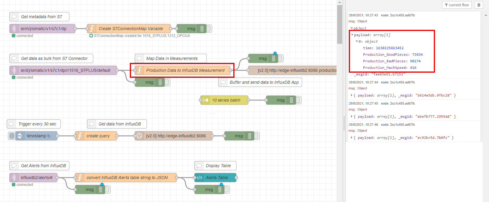

#### Bulk message receiving from MQTT

Through the **"MQTT In"** node, Flow Creator connects to the MQTT IE Databus Broker, using the topic dedicated to the PLC configured for the purpose, named in this example as `"1516_S7PLUS"`:

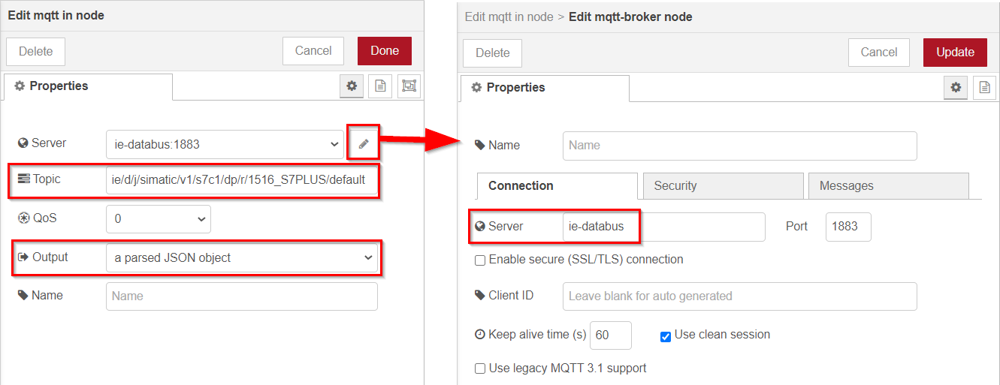

Here, at each read cycle, we will receive messages from MQTT IE Databus, which contains all the data read from the S7-1500 PLC configured within the S7 Connector application. The name of the configured PLC will be part of the topic to be subscribed.

Below is an example of output for the "MQTT In" node:

```json
{
  "topic": "ie/d/j/simatic/v1/s7c1/dp/r/1516_S7PLUS/default",
  "payload": {
    "seq": 84631,
    "vals": [
      {
        "id": "101",
        "qc": 3,
        "ts": "2021-03-10T22:23:04.146Z",
        "val": 80
      },
      {
        "id": "102",
        "qc": 3,
        "ts": "2021-03-10T22:23:04.146Z",
        "val": 20
      },
      {
        "id": "103",
        "qc": 3,
        "ts": "2021-03-10T22:23:04.146Z",
        "val": 120.5
      }
    ]
  }
}
```

Connecting to the MQTT broker SIMATIC IE Databus requires the configuration of a data exchange-enabled user. In this case it was configured using the following parameters:

| IE Databus Address | IE Databus Port | IE Databus User | IE Databus Password |
|--------------------|-----------------|-----------------|---------------------|
| ie-databus | 1883 | edge | edge |

#### Pre-processing Data for InfluxDB

Before being able to save the received data in the Influx DB database it will be necessary to format the message received from the **"MQTT In"** node through a **"function"** node, according to the specifications required by the dedicated **"influx-out"** node that allows you to send in different ways new data inside the InfluxDB database, as specified in the dedicated [node-red-contrib-influxdb documentation](https://flows.nodered.org/node/node-red-contrib-influxdb).

In this case we will create an InfluxDB **Measurement** called `"production"` in which we will insert several InfluxDB **"Fields"** corresponding to each of the variables read by S7 Connector:

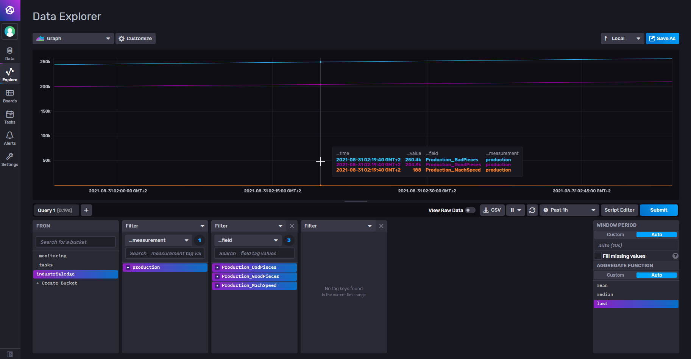

See [Usage](#usage) section for more details.

Considering the variables used in this application example, in order to insert the data read into the InfluxDB database with the model presented above, the **"influx-out"** node requires that the `msg.payload` property at the node's input has the following structure:

```json
[
  [
    {
      "Production_BadPieces": 2,
      "Production_GoodPieces": 10,
      "time": 1616881844000000
    }
  ],
  [
    {
      "Production_GoodPieces": 14,
      "time": 1616881845000000
    }
  ]
]
```

The **"function"** node allows you to process an input message through a script in Javascript language and create one or more output messages.
With the following function we will transform the msg.payload property received from IE Databus with the **"MQTT In"** node, which contains all the data read by the S7-1500 PLC configured in the S7 Connector application, into a message corresponding to the standard required by the **"influx-out"** node as indicated above:

```js
// create out message
let outMsg = {"payload": null};

// Insert here the ordered output tag list
let selectedTags = ["Production_GoodPieces",
                    "Production_BadPieces",
                    "Production_MachSpeed"];
   
// get S7Map variable
let S7ConnectionMap = flow.get("S7ConnectionMap");

// find index of 1516_S7PLUS connection
let connectionIndex = S7ConnectionMap.nameList.indexOf("1516_S7PLUS");
// use the index to get the right map
let nameIDMap = S7ConnectionMap.nameIDMaps[connectionIndex];

// get IDs of selected Tags
let selectedIDs = selectedTags.map(name => nameIDMap.get(name));

// create an empty series with null timestamp
let outSeries = [{"time": null}]

// iterate through readed tags
for (let i=0; i < msg.payload.vals.length; i++){
    
    // iterate through selected ids
    for(let j=0; j < selectedIDs.length; j++){
    
        // search for tagselectedTags[j]
        if(msg.payload.vals[i].id == selectedIDs[j])
        {
            outSeries[0].time = new Date(Date.parse(msg.payload.vals[i].ts)).getTime();
            outSeries[0][selectedTags[j]] = Number(msg.payload.vals[i].val.toFixed(2));

            // stop on first match, ids are uniques
            break;
        }
    }
}

// if time was changed means that some ids was finded
if (outSeries[0].time)
{
    outMsg.payload = outSeries;
    return outMsg;
}
```

This function will output from the **"function"** node an array containing one or more **"fields"** according to the input data received. The `"id"` property of each variable read is compared with the id of the selected variables retrieved through the **"S7ConnectionMap"** global variable and in case of a match the function continues. The **timestamp** (epoch) in ms is obtained from the `"ts"` property of each variable read. The value of the variable identified by the `"val"` property is converted to a number and eventually approximated to 3 decimal places.

#### Sending Data to InfluxDB

InfluxDB APIs are the basis of the Node-RED node **node-red-contrib-influxdb**, created to write and query data from an InfluxDB time series database.
These nodes support both InfluxDB 1.x and InfluxDB 2.0 databases in a configurable manner. To check the options provided by the different versions see dedicated documentation of the [node-red-contrib-influxdb](https://flows.nodered.org/node/node-red-contrib-influxdb) node.

The **edge-influxdata-stack** application provided includes the `"edge-influxdb2"` service container based on InfluxDB version `2.0` and exposes a pre-defined **bucket** named `"industrialedge"` in the **organization** `"industrialedge"`with pre-configured `"industrialedge" / "industrialedge"` **user** and **password**. This application can be contacted by other applications present both on the Edge Device used and by **external networks** connected to the physical ports of the Edge Device thanks to the Port forwarding functionality offered by the Docker service.
These parameters can be inserted directly in the configuration of the "Server" parameter of the nodes of the node-red-contrib-influxdb library:

| Service Name | Hostname | Internal Port | External Host | External Port | Bucket Name | Organization | User | Password |
|---------------|---------------|------|------------------------------------|-------|------|------|-----|----|
| edge-influxdb2 | edge-influxdb2 | 8086 | [ied-ip-address] or [ied-dns-name] | 38086 | industrialedge | industrialedge | industrialedge | industrialedge |

Starting from InfluxDB 2.0, an **Authorization Token** is needed to be authorized for publishing data. See [Generate Tokens](#generate-tokens-for-external-clients-or-data-sources) section.

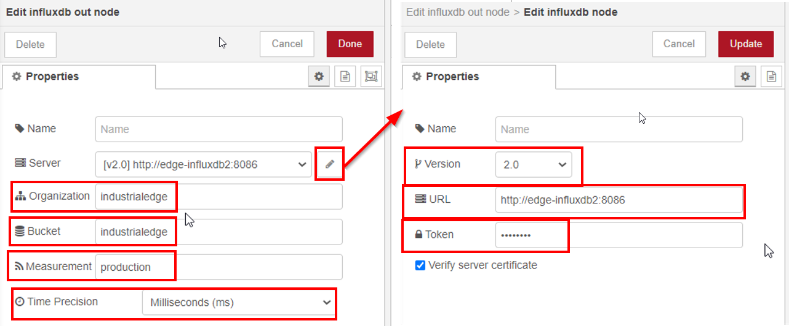

Using the **"Advanced Query Options"** checkbox, it is also possible to predefine the precision of the time inserted in the data series. As defined in the "InfluxDB Data Preprocessing" paragraph, in this application example the time (epoch) is calculated in ms and the **"Time Precision"** option is therefore set to `"milliseconds (ms)"`.

### Dashboard for Displaying Results with InfluxDB UI

With the new InfluxDB Web UI, among other things, you can both explore data in various databases and quickly create Web Dashboards with graphical objects.

In this application example, the [Production_Dashboard.json](examples/Production_Dashboard.json) dashboard is provided, which can be directly imported as a file in JSON format. To import the dashboard:

1. Connect to the InflucDB Web interface using the URL `http://[device-ip-address]:38086`
2. In the section **"Boards"** press the button **"Import Dashboard"**.
3. And choose the provided [Production_Chronograf.json](examples/Production_Chronograf.json) file
4. At the completion the dashboard "Production" will be visible


### Read data from InfluxDB database with temporal and conditional filtering

In addition to entering new data within an InfluxDB database "measurement", you may need to query the database to process and request **historical data**, for example for visualization, analysis or reporting purposes.
The **node-red-contrib-influxdb** node library provides the ability to perform **custom queries** to query one or more measurements in an InfluxDB database via the **"influxdb-in"** node. The query is specified in the node configuration or via the `msg.query` property. The result of the query is returned in the output message from the node with via the `msg.payload` property.

Within the [flows_influxdb2_appexample](examples/flows_influxdb2_appexample.json) flow provided in this application example, the reading of data from the InfluxDB database is triggered by a trigger message from the **"inject"** node every 30 seconds, after which the **"function"** node will create the desired query and send it to the **"influxdb-in"** node that will request data to InfluxDB database. Once the response is obtained, it is possible to explore results using a **"debug"** node for displaying data as JSON.
The details of the NodeRED flow involved are shown below:

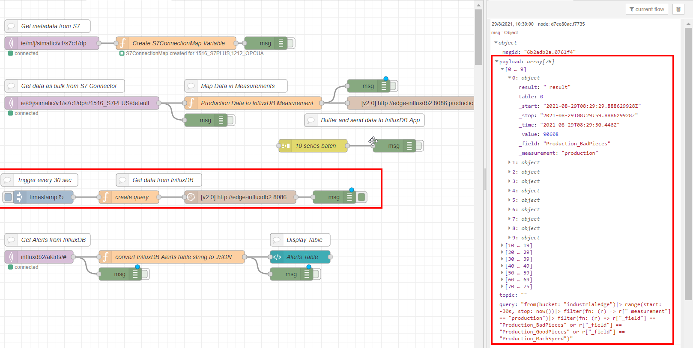

In this application example we will use the node **"influxdb-in"** connected to the database service `"edge-influxdb2"` and a dedicated query to read the saved data `"Production_GoodPieces"`, `"Production_BadPieces"` and `"Production_MachSpeed"` in the last 30 seconds.

The syntax used for the query is **Flux**. For more information about the Flux query language see [Documentation](#documentation) below.

```js
// create the query based on start and stop time
let query = 'from(bucket: "industrialedge")' +
  '|> range(start: -30s, stop: now())' +
  '|> filter(fn: (r) => r["_measurement"] == "production")' + 
  '|> filter(fn: (r) => r["_field"] == "Production_BadPieces" ' + 
                        'or r["_field"] == "Production_GoodPieces" ' + 
                        'or r["_field"] == "Production_MachSpeed")'
```

The **query** above will select the data of the **last 30 seconds** of the fields `"Production_GoodPieces"`, `"Production_BadPieces"` and  `"Production_MachSpeed"`.
The database response is then output to the **"influxdb-in"** node with the `msg.payload` property. This will be an array containing the different time series of **"Fields"** and their values.

### Generate Alerts from InfluxDB to IE Databus

In this example [InfluxDB Tasks](https://docs.influxdata.com/influxdb/cloud/process-data/get-started/) functionality is used to generate alerts as MQTT Messages from InfluxDB to **IE Databus**, depending on the value of `"Production_MachSpeed"`, a Tag that is stored as a **Field** in the InfluxDB bucket `"production"` as shown in the example [above](#writing-data-from-ie-databus-with-mqtt-protocol-to-influxdb-database).

An InfluxDB task is a scheduled [Flux script](https://docs.influxdata.com/influxdb/v2.0/query-data/get-started/) that takes a stream of input data, modifies or analyzes it in some way, then stores the modified data in a new bucket or performs other actions.

#### Enable InfluxDB topic on IE Databus

The generated alerts needs to be published from InfluxDB via MQTT to IE Databus Edge App, but this requires an authorized user and a specific topic where InfluxDB can publish the alerts data.

In this example the credentials `user: edge / password: edge` already configured are used, and the **topic** dedicated to InfluxDB alerts is set to `influxdb2/alerts/<alert-name>`.

To configure the InfluxDB Alerts topic in IE Databus:

- Open Industrial Edge Management Portal Web Page
- Go to **Data Connection** section
- Open **IE Databus Configurator** and select the Edge Device where edge-influxdb2 app is installed
- Add the new topic `influxdb2/#` for the `edge` user
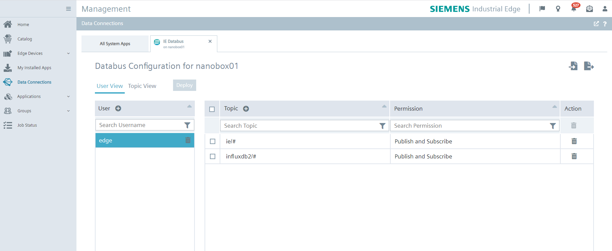
- Deploy the new configuration and wait for success

Now InfluxDB can be set to publish Alerts messages to IE Databus with the configured user, password and topic.

#### Configure the Alert Task on InfluxDB

To create a new task for generating alerts:

- go to **Tasks Section** in the left menu and click on the **"Create Task"** button:
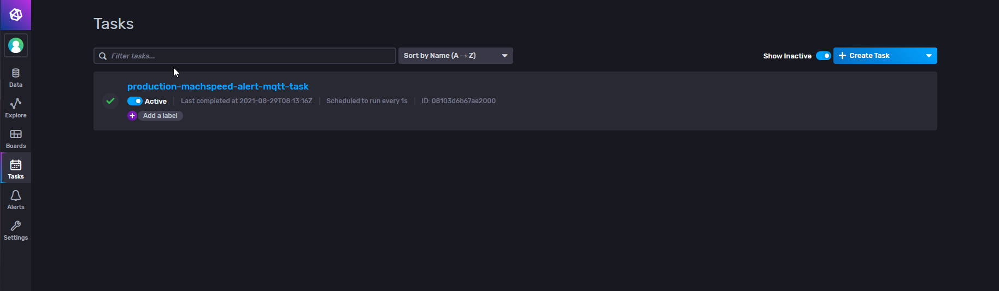

- Insert **Task Name** property _(e.g."production-machspeed-alert-mqtt-task")_ and set the repeat time of the task in **Every** property _(e.g.1s)_
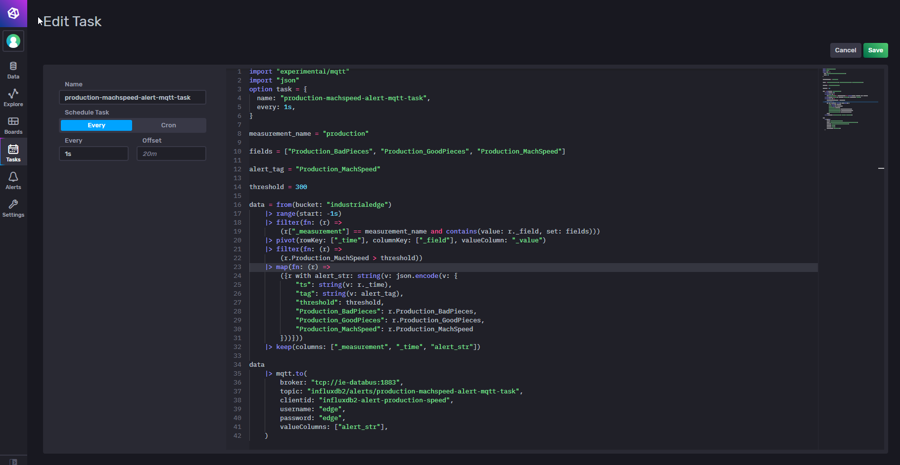

- Copy the Flux script below and paste it in the **Flux Editor**:

```js
import "experimental/mqtt"
import "json"

measurement_name = "production"
fields = ["Production_BadPieces", "Production_GoodPieces", "Production_MachSpeed"]
alert_tag = "Production_MachSpeed"
threshold = 300

data = from(bucket: "industrialedge")
    |> range(start: -1s)
    |> filter(fn: (r) =>
        (r["_measurement"] == measurement_name and contains(value: r._field, set: fields)))
    |> pivot(rowKey: ["_time"], columnKey: ["_field"], valueColumn: "_value")
    |> filter(fn: (r) =>
        r.Production_MachSpeed > threshold))
    |> map(fn: (r) =>
        ({r with alert_str: string(v: json.encode(v: {
            "ts": string(v: r._time),
            "tag": string(v: alert_tag),
            "threshold": threshold,
            "Production_BadPieces": r.Production_BadPieces,
            "Production_GoodPieces": r.Production_GoodPieces,
            "Production_MachSpeed": r.Production_MachSpeed
        }))}))
    |> keep(columns: ["_measurement", "_time", "alert_str"])

data
    |> mqtt.to(
        broker: "tcp://ie-databus:1883",
        topic: "influxdb2/alerts/production-machspeed-alert-mqtt-task",
        clientid: "influxdb2-alert-production-speed",
        username: "edge",
        password: "edge",
        valueColumns: ["alert_str"],
    )
```

The Flux script above:

- import the packages ["experimental/mqtt"](https://docs.influxdata.com/influxdb/v2.0/reference/flux/stdlib/experimental/mqtt/) and ["json"](https://docs.influxdata.com/influxdb/v2.0/reference/flux/stdlib/json/) that will be used respectively for sending MQTT messages and for encoding a JSON object to a string.
- define the variables `measurement_name`, `fields`,  `alert_tag` and a `threshold` that will be used to filter the data to be analyzed for possible alerts. You can customize this variables to your needs.
- set `data` variable as result of a query that from the bucket `"industrialedge"` selects all the defined `fields` in the defined `measurement_name` and transform them into a [pivot](https://docs.influxdata.com/influxdb/v2.0/reference/flux/stdlib/built-in/transformations/pivot/) table to permit single column filtering. Then, based on the selected tag `Production_MachSpeed`, filter the data rows that contain a value **greater than** then the defined `threshold` value. The last stage for `data` results is to create a new column called `alert_str` that will contain a JSON string with all values from the same row by using the [json.encode()](https://docs.influxdata.com/influxdb/v2.0/reference/flux/stdlib/json/encode/) function. With `keep` function all the columns except `"_measurement"`, `"_time"` and `"alert_str"` are removed from the result.
- use [mqtt.to()](https://docs.influxdata.com/influxdb/v2.0/reference/flux/stdlib/experimental/mqtt/to/) function to send the column  `"alert_str"` from `data` table as string to the **IE Databus** MQTT Broker. Here the `broker` is the service name of `ie-databus` (on the `proxy-redirect` network) and the credentials used [above](#enable-influxdb-topic-on-ie-databus) are typed in `user` and `password` properties. Also the `topic` is set to `"influxdb2/alerts/production-machspeed-alert-mqtt-task"` as `influxdb2/#` is an available topic in IE Databus Configurator.

The script above will generate a MQTT message every seconds (if any alert is found) like the following,wWhere two rows are visible, each in the form `[measurement_name] alert_str=[JSON_object] [timestamp]`:

```text
production alert_str="{\"Production_BadPieces\":263424,\"Production_GoodPieces\":null,\"Production_MachSpeed\":478,\"tag\":\"Production_MachSpeed\",\"threshold\":300,\"ts\":\"2021-08-29T22:34:59.738000000Z\"}" 1630276499738000000
production alert_str="{\"Production_BadPieces\":263426,\"Production_GoodPieces\":422321,\"Production_MachSpeed\":479,\"tag\":\"Production_MachSpeed\",\"threshold\":300,\"ts\":\"2021-08-29T22:34:59.849000000Z\"}" 1630276499849000000
```

For more information about Flux Scripts see [Documentation](#documentation) below.

#### Subscribe to InfluxDB Alerts using Flow Creator

Now it is possible to access the Alerts data published by InfluxDB to IE Databus from other Edge Apps like **Flow Creator**.

As shown [above](#configure-the-alert-task-on-influxdb), the actual MQTT Message will be a table in string format containing all the `alert_str` JSON Object string. To extract this JSON Object a text parsing is needed.

Using the provided [flows_influxdb2_example.json](examples/flows_influxdb2_example.json) you can find an example on how to transform the received MQTT Message to an array of JSON Object containing the data of `alert_str` field:

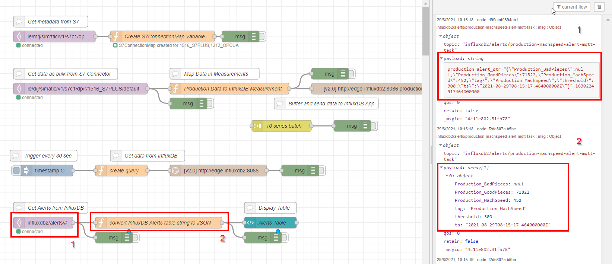

By using the function:

```js
// create table rows
let rows = [];

// split each row of the table string
let strRows = msg.payload.split("\n");
// get how many rows
let numRows = strRows.length - 1;

// parse each table string row to JSON
for (let i=0; i < numRows; i++)
{
    // remove measurement name and field name
    let tmpStr = strRows[i].replace("production alert_str=\"","");
    // substring on closing bracket to remove time
    tmpStr = (tmpStr.substring(0, tmpStr.indexOf("}") + 1))
    // fix double quotes and backslashes
    tmpStr = tmpStr.replace(/\"/g, "'").replace(/\\/g,"").replace(/'/g,"\"");
    // parse to json and push to rows array
    let jsonAlert = JSON.parse(tmpStr)
    rows.push(jsonAlert);
}

// formatted json rows as payload
msg.payload = rows;

return msg;
```

the string data table is parsed to extract an array of JSON Objects like:

```json
{
    "payload": [
        {
            "Production_BadPieces": 263424,
            "Production_GoodPieces": null,
            "Production_MachSpeed": 478,
            "tag": "Production_MachSpeed",
            "threshold": 300,
            "ts": "2021-08-29T22:34:59.738000000Z"
        },
        {
            "Production_BadPieces": 263426,
            "Production_GoodPieces": 422321,
            "Production_MachSpeed": 479,
            "tag": "Production_MachSpeed",
            "threshold": 300,
            "ts": "2021-08-29T22:34:59.849000000Z"
        }
    ]
}
```

#### Visualize Alerts on Flow Creator Dashboard

From the parsed Alert JSON Array, is it simple to use a node like [UI Template](flows_influxdb2_example.json) for creating a dynamic table that shows received alerts:

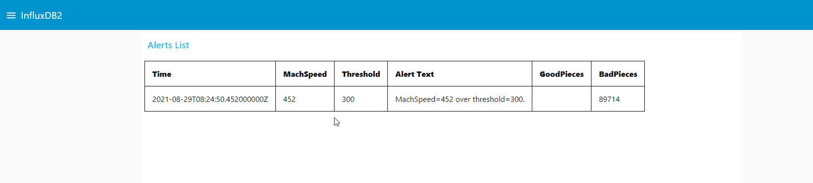

In the UI Template node the following HTML Code (with Angular.JS `ng-repeat` function) is used:

```html
<style>
    table, th, td {
    border: 1px solid black;
    border-collapse: collapse;
    }
    th, td {
    padding: 15px;
    }
</style>

<div class="table-wrap" style="  height: 500px; overflow-y: auto">
    <table>
        <tr style="font-weight:800;">
            <td>Time</td>
            <td>MachSpeed</td>
            <td>Threshold</td>
            <td>Alert Text</td>
            <td>GoodPieces</td>
            <td>BadPieces</td>
        </tr>
        <tr ng-repeat="row in msg.payload">
            <td>{{row.ts}}</td>
            <td>{{row.Production_MachSpeed}}</td>
            <td>{{row.threshold}}</td>
            <td>MachSpeed={{row.Production_MachSpeed}} over threshold={{row.threshold}}.</td>
            <td>{{row.Production_GoodPieces}}</td>
            <td>{{row.Production_BadPieces}}</td>    
        </tr>
    </table>
</div>
```

This will create a table where each row correspond to the properties of each Alert in the Alerts JSON Array.

## Documentation

- [InfluxDB 2.0 - Convert results to JSON](https://docs.influxdata.com/influxdb/v2.0/process-data/common-tasks/convert_results_to_json/)
- [InfluxDB 2.0 - Send Alert Email](https://docs.influxdata.com/influxdb/cloud/monitor-alert/send-email/)
- [InfluxDB 2.0 - Use multiple fields in a calculation](https://docs.influxdata.com/influxdb/cloud/query-data/common-queries/multiple-fields-in-calculations/)
- [InfluxDB 2.0 - Query using Conditional Logic](https://docs.influxdata.com/influxdb/cloud/query-data/flux/conditional-logic/)
- [InfluxDB 2.0 - Use values to calculate a new column](https://docs.influxdata.com/influxdb/cloud/query-data/common-queries/calculate_new_column/)
- [InfluxDB 2.0 - Query data with Flux](https://docs.influxdata.com/influxdb/v2.0/query-data/flux/)
- [InfluxDB 2.0 - Flux Language Specification](https://docs.influxdata.com/influxdb/cloud/reference/flux/language/)
- [Flux Language Advanced Features Guide](https://www.sqlpac.com/en/documents/influxdb-flux-language-advanced-features.html)
- [node-red-contrib-influxdb](https://flows.nodered.org/node/node-red-contrib-influxdb)
- [Docker Hub - InfluxDB](https://hub.docker.com/_/influxdb)

You can find further documentation and help about Industrial Edge in the following links:

- [Industrial Edge Hub](https://iehub.eu1.edge.siemens.cloud/#/documentation)
- [Industrial Edge Forum](https://www.siemens.com/industrial-edge-forum)
- [Industrial Edge landing page](https://new.siemens.com/global/en/products/automation/topic-areas/industrial-edge/simatic-edge.html)
- [Industrial Edge GitHub page](https://github.com/industrial-edge)
- [Industrial Edge App Developer Guide](https://support.industry.siemens.com/cs/ww/en/view/109795865)

## Contribution

Thanks for your interest in contributing. Anybody is free to report bugs, unclear documentation, and other problems regarding this repository in the Issues section or, even better, is free to propose any changes to this repository using Merge Requests.

## License & Legal Information

Please read the [Legal Information](LICENSE.md).
